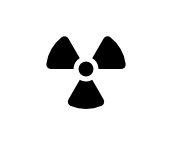
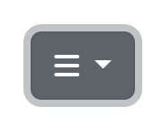

# Radiation & You

## Introduction

The purpose of this website is to give the user a brief and simple overview of the basics of radiation. As a trained healthcare professional in the radiology department, I have the knowledge and understanding of how radiation is used in hospitals; and I would like to share this information through HTML5 and CSS3 to the best of my ability. 

I work full-time in a children’s hospital and hence this website will be catered towards the parents of the children, and possibly the children themselves if they so wished, attending the hospital for a scan. Hence, I aim that this website (layout, content) is designed in a way that a child could understand, but still possess credibility and instills trust in their parents that the information they are reading is accurate and dependable. 

## Features

There are 5 pages on the website:
- Home (index.html)
- What Is Radiation? (radiation.html)
- How Do We Use Radiation in Medicine? (uses.html)
- Are There Any Risks Associated with X-rays? (risk.html)
- FAQs (questions.html)

There are 15 features on this website: 
### Logo and nav bar

#### Logo
- Logo acts as home button as linked to index.html.
- Logo depicts radiation symbol which is very appropriate for this website.
- Logo:hover styles the radiation symbol with yellow circle background which is a well-known design and colour associated with radiation. This added design allow uses to know this is a clickable element.

#### Nav
- Nav appears as dropdown to right of header.
- Nav chosen to be displayed as dropdown to ease responsiveness and consistency of each page header at different screen sizes. 
- While a bootstrap element, font awesome icon chosen by developer instead of pre-defined text. Icon chosen to steer wesbite towards more intuitive layout. This symbol was well-known to the developer through other websites they had visited previously and hence developer believe other users would know this symbol contained the navigation bar. 
- A downside of using this boostrap element was that it could not be styled by the developer. As this was the devloper's first time using bootstrap, they were not 100% comfortable using and and adapting elelments to the page. 
- In future, the developer would like to add add their own dropdown code and style accordingly to completely match website color scheme.

- Hero image and cover text
- Radiation types (3)
- Radon map iframe
- Radiation uses types (5)
- Risks table
- Contact form
- FAQ section 
- Footer

## Testing 

## Deployment

## Credits 
