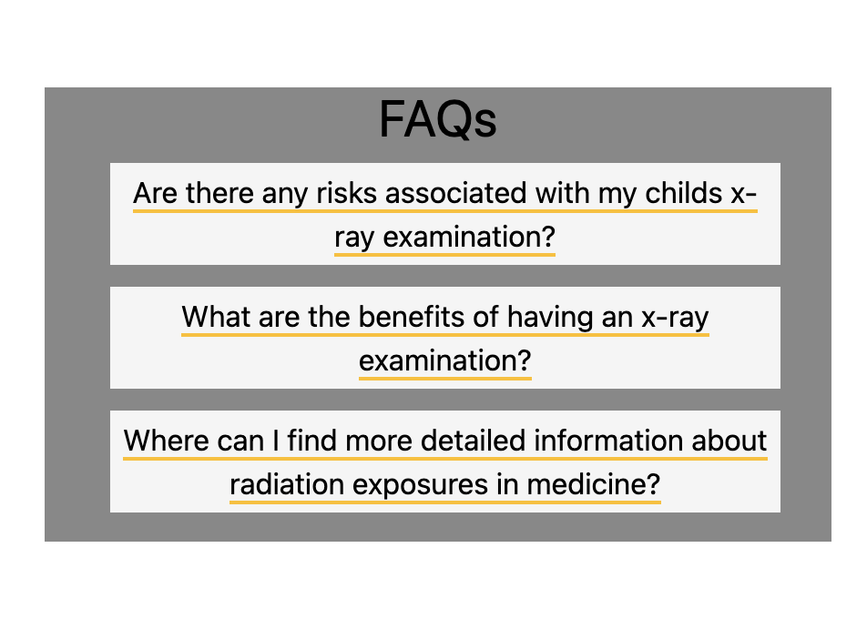
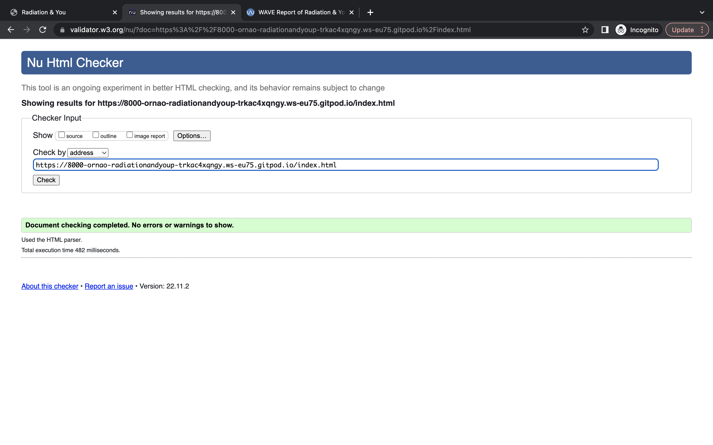
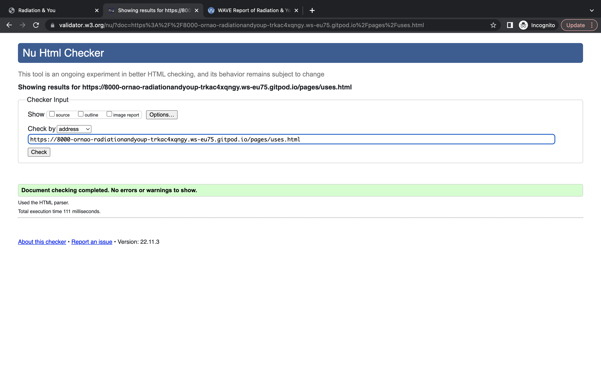
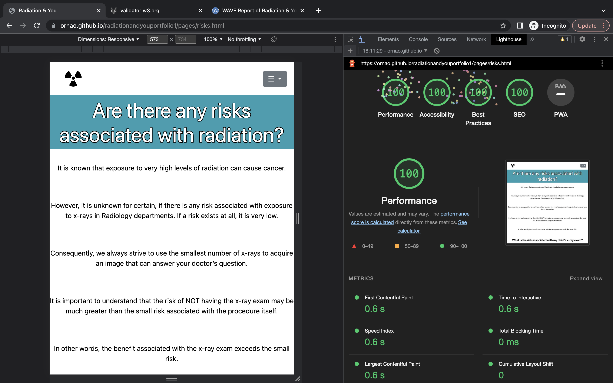
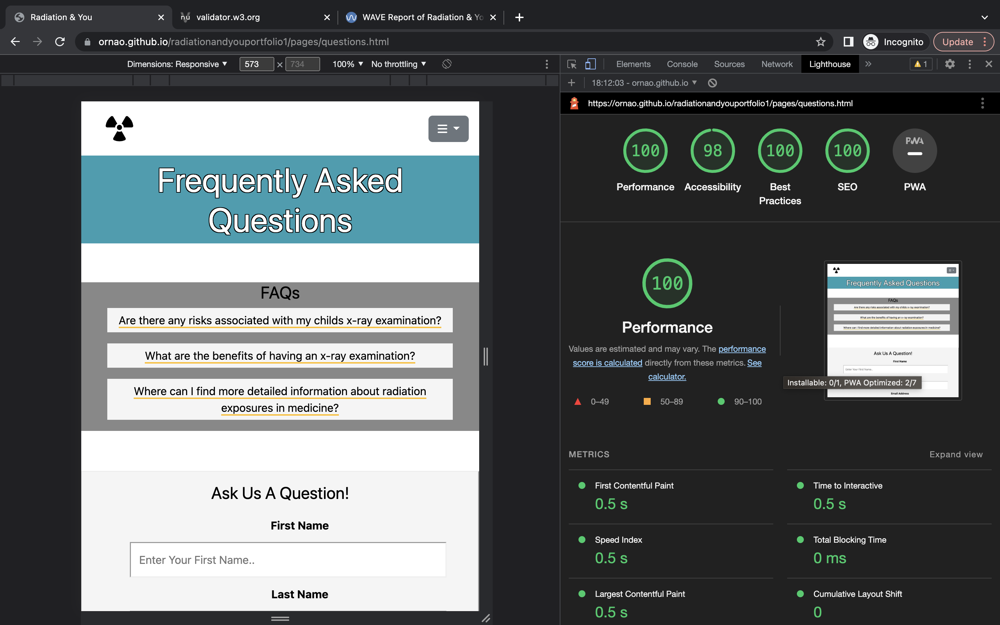

# Radiation & You

<a href="https://ornao.github.io/radiationandyouportfolio1/">Deployed Website</a>

The purpose of this website is to give the user a brief and simple overview of the basics of radiation. As a trained healthcare professional in the radiology department, I have the knowledge and understanding of how radiation is used in hospitals; and I would like to share this information through HTML5 and CSS3 to the best of my ability. 

I work full-time in a children’s hospital and hence this website will be catered towards children and their parents. Hence, I aim that this website (layout, content) is designed in a way that a child could understand, but still possess credibility and instills trust in parents that the information they are reading is accurate and dependable. 

Project Goals:
- Create a resource that explains radiation and its use in hospital in a very simple and visually appealing format 
- This website should include colorful images and simple definitions, should not overwhelm the user with information 
- Important information such as radiation dose risk information should be able to be navigated to directly from the home page

Target audience:
- Parents of children attending the hospital for a scan 
- The children having the scan 
- Anyone interested in a brief understanding of radiation and its use in hospitals

Project Demands: 
- Factual, digestible content
- Detailed explantions when necessary for example in FAQ section
- Clear layout and design
- Multiple navigation elements 

Project Expectataions:
- A MVP within the time-frame and skill-level of developer which meets the goals and demands listed above 

## Table of Contents

- [User Experience(UX)](#ux)
    - [Structure](#structure)
    - [Design](#design)
        - [Colour](#colour)
        - [Font](#font)
        - [Images](#images)
        - [Content](#content)
    - [User Stories](#user-stories)
        - [First Time User](#first-time-user)
        - [Returning User](#returning-user)
        - [Site Owner](#site-owner)
     - [Wireframes](#wireframes)
- [Features](#features)
   - [Logo](#logo)
   - [Nav](#nav) 
      - [Hamburger](#hamburger)
      - [Back to Top](#back-to-top)
      - [Next Page](#next-page)
   - [Main-image](#main-image)  
   - [Cover-text](#cover-text) 
   - [Guide](#guide) 
   - [Radiation-types](#radiation-types)
   - [Radon-map-iframe](#radon-map-iframe)
   - [Uses-types](#uses-types)
   - [Risk-table](#risk-table)
   - [Contact-form](#contact-form)
   - [Aside](#aside)
   - [FAQs](#faqs)
   - [Future Features](#future-features)
- [Technology Used](#technology-used)   
- [Testing](#testing)
   - [Automated](#automated) 
       - [Jigsaw](#jigsaw) 
       - [HTML validator](#html-validator) 
       - [Accessibility](#accessibility)
       - [Performance](#performance)
   - [Non-Automated](#non-automated)
       - [Testing User Stories](#testing-user-stories)
       - [Bugs](#bugs)
- [Deployment](#deployment)
- [Credits](#credits)
    - [Layout](#layout)
    - [Media](#media)
    - [Content](#content)
         - [Frameworks, Libraries & Programs Used](#flp)
    - [Code](#code)
- [Acknowledgements](#acknowledgements)

    -

    - [Home](#home)
        - [What is radiation?](#radiation)
        - [How do we uses radiation in medicine?](#uses)
        - [Are there an risks assocatied with radiation?](#risks)
        - [Faqs](#faqs)

## User Experience (UX)

### Structure 

There are 5 pages on the website:
- Home (index.html)
    - Gives user clear understanding of what site is about at a glance. 
    - Provides multiple navigation options for easy access to content throughout the site.
- What Is Radiation? (radiation.html)
    - Gives user simple definitions in an easy to digest format 
    - Gives good nav links 
- How Do We Use Radiation in Medicine? (uses.html)
    - Gives user simple definitions in an easy to digest format 
    - Gives good nav links
- Are There Any Risks Associated with X-rays? (risk.html)
    - Provides key info in a simple and easy to understand way 
    - Gives good nav links
- FAQs (questions.html)
    - Gives user option to contact site owner 
    - Provides good nav links within page
    - Outlines detailed answers to possible questions

### Design 

#### Colour

Amber-yellow and dark-turquoise were the main colors used for designing the site. Amber-yellow is a colour associated with the radiation symbol and hence I believed was appropriate to be used in this site because of that connotation. Dark-turquoise is the color of the main-image and hence for consistency of design was used across site in different ways to tie together features. These colours are bright and vivid which is visiually appealing for children. Moreover, the fact that two main colors were chosen gives a simplicity and professionalism to the wesbite that would appeal to parents. Other neutral colours were used for other elements to not overwhelm the design. The dark-turquoise colour was made darker to allow for better contrast-ratio to mitigate acessibility concerns. 

#### Font

Roboto and Montserrat were the fonts chosen for the website. I had previously looked up most popular fonts for use in educational website and both these fonts were in the top 10.

<a href="https://www.ilovewp.com/resources/education/wordpress-for-schools/most-used-google-fonts-on-school-websites/">Website link here</a>

#### Images

Images of the wesbite were very important for giving an overall inviting, fun, educational feel to the wesbite which is important for both children and their parents which whom this site is aimed at. I spent many hours scrolling through Pexels, Unsplash and finally Freepik to find the type of descriptive applicable images I wanted. Futher explanation of choice of image for a particular section is detailed below in features. 

#### Content 

Content aimed to give a basic overview of radiation and its uses for children and their parents. Hence, simple definitions and limited text were utilised to avoid overwhelming the users. Website content adapted with permission from poster approved by CHI Radiation Safety Committee (October 2019). Original produced by the Radiation Safety Committee, CHI at Crumlin, Version 1d (January 2017). 

## User Stories 
### First time user 
1. As a first time user, I want to easily understand the main purpose of the site.
2. As a first time user, I want to be able to easily navigate through the site to find content.
3. As a first time user, I don't want to be overwhelmed with information. 
4. As a first time user after reading through the site, I want to see what types of questions other people have asked.   
### Returning user
5. As a returning user, I want to access the contact us form because I've been curious about a question in relation to my/ my child's scan.
6. As a returning user, I want to quicky access the risks associated with radiation page to reread before my child's scan. 
7. As a returning user, I want to go back and check the radon gas levels of the houses of other people I know (I checked my house my first time using the wesbite).  
8. As a returning user, I want a brief reminder about what my scan is.

### Site owner 
9. As the site owner, I want it be easy for users to navigate through the site without having scroll to top of page again.
10. As the site owner, I want the users to be able to contact us so the site FAQs section can be updated reguarly helpful questions and answers.
11. As the site owner, I want the content to be concise and easy to understand and the design to give a positive emotional response. 

### Wireframes

Home

 

What is Radiation?

 

How do we use radiation in medicine?

 

Are there any risks associated with radiation?

 

FAQS

 

 

## Features (and design choices further explained)

There are 14 features on this website: 

### Logo and nav bar

#### Logo
- Logo gives the user quick asses to the home page.
- Logo depicts radiation symbol which is very appropriate for this website as it is consistent with the radiation design theme.
- Logo:hover styles the radiation symbol with yellow circle background which is a well-known design and colour associated with radiation. This added design allow users to know this is a clickable element.
- User stories covered: 1,2

#### Nav
## Hamburger
- A recognisable menu symbol for the user to know of.
- Nav chosen to be displayed as dropdown to ease responsiveness and consistency of each page header at different screen sizes. 
- User stories covered: 2, 5, 7

## Back to top 
- A nav element included for ease of navigation throughtout the site for the user 
- User stories covered: 9

## Next page 
- A nav element included for ease of navigation throughtout the site for the user 
- User stories covered: 2, 9

### Main image and cover text
- User stories covered: 1, 3, 11

#### Main image 
- Cartoon style x-ray of human body as the developed wanted the website assessible to children (as they form part of the target audience). 
- Inclusion of a form of radiation (x-ray) and human body (x-rayed skeleton) was important to the developer for the title 'Radiation & You' to be tied in. Hence, this particular image was chosen as the main image. 
- Original image was somewhat muted and bland so developer increased satruation to match bright colour scheme of rest of site. 
- Hence, the user is clear about what the site is about at first glance and brief look. 

#### Cover Text
- h1 element states the title of the site and h2 elemnt gives a brief description of the site to further explain and tie in main image and title. The inclusion of all these elements leaves the user in no doubt to what the site is about. 
- Circle in amber-yellow was chosen in omage to well-know radiation symbol and ties in with logo: hover for design consistency. 

### Guide 
- Provides nav on home page for users that may not know of hamburger. 
- User stories covered: 2, 4, 5, 6, 7, 8

### Radiation types (3)

- Used flex box to style boxes which aided in consistency and resposiveness of website.
- Created shadow effect behind boxes and feels this adds a nice touch to website.
- Images again were of the cartoonish style as the website was designed with children in mind but in the developer's opinion these still appeared professional enough for parents to engage with. 
- User stories: 3, 11

### Radon map iframe

- Included iframe map as an element of user interaction if they were interested in checking where their house was located in relation to radon gas levels. 
- User stories covered: 7

### Radiation uses types (5)

- Gives the user a quick overview of the type of scan and where it is commonly used and why.
- Includes an appropriate image related to some aspect of the scan for good visual impact for the user.
- Font color of heading of each different section of was chosen as common color of each of the images on this display on this page for appealing display.
- User stories: 3, 8, 11

### Risks table

- Gives the user information of risks in a visual quick and easy way 
- User stories: 3, 6, 11

###  Contact form 

- Gives the user the opportunity to contact us with any questions they may have
- User stories: 5, 10

### Aside 
- Gives a quick overview of questions that have already been asked to give the user an idea of questions that may want to ask 
- Includes links to those questions further down the page 
- Underlined as per consistency with other clickable links on the page 
- User stories covered: 4

### FAQs
- May answer users questions or give them inspiration to ask their own
- User stories covered: 4

### Future Features
- Dropdown menu 
    - While a bootstrap element, font awesome icon chosen by developer instead of pre-defined text. Icon chosen to steer wesbite towards more intuitive layout. This symbol was well-known to the developer through other websites they had visited previously and hence developer believe other users would know this symbol contained the navigation bar. 
    - A downside of using this boostrap element was that it could not be styled by the developer. As this was the devloper's first time using bootstrap, they were not 100% comfortable using and and adapting elelments to the page. 
    - In future, the developer would like to add add their own dropdown code and style accordingly to completely match 
    website color scheme.
- Begin button in main image
   - A further navigation element that could triiger the dropdown menu so users do not need to scroll down for guide 
   - This button could help someone if they were not familar with a hamburger dropdown menu also

## Technology Used 

- Bootstrap v5.0
- Git
- GitHub
- Gitpod
- iloveimg - photos resizing website
- Balsamiq
- Google Fonts
- Font Awsome

## Testing 
### Automated 
- #### Jigsaw 
- (CSS Code Validator)
    

       
All CSS

        
       
       

-  #### HTML validator 
    - 

       
Home

        
       
       

    - 

       
What is radiation?

        
        

    - 

       
How do we use radiation in medicine?

        
       

    - 

       
Are there any risks associated with radiation? 

        
        

    - 

       
FAQs

        
        

   
- #### Accessibility 
  - Wave 
    - 

       
Home

        
       
       

    - 

       
What is radiation?

        
       
       

    - 

       
How do we use radiation in medicine?

        
       
       

    - 

       
Are there any risks associated with radiation? 

        
       
       

    - 

       
FAQs

        
       
       
 

### Performance
- Lighthouse 
     - 

       
Home

        
       For desktop and phone
       

       
       

    - 

       
What is radiation?

        
       For desktop and phone
       
      Did not include performance of this page on phone. 60ish performance score as images were bigger than necessary at smaller screen sizes. Need to figure out how to add media query to html as img was used instead of background value. 
       

    - 

       
How do we use radiation in medicine?

        
       For desktop and phone
       
       
       

    - 

       
Are there any risks associated with radiation? 

        
       For desktop and phone
       
       
       

    - 

       
FAQs

        
       For desktop and phone
       
       
       

### Non-Automated

Testing User Stories

1. As a first time user, I want to easily understand the main purpose of the site.

| **Feature** | **Action** | **Expected Result** | **Actual Result** |
|-------------|------------|---------------------|-------------------|
| Main image and cover text | Should only need to glance at | Main image and cover text should show clear purpose | Works as expected |
| Logo | Should only need to glance at | Recognise the symbol and further tells the user this is a wesbite based around radiation | Works as expected |

2. As a first time user, I want to be able to easily navigate through the site to find content.

| **Feature** | **Action** | **Expected Result** | **Actual Result** |
|-------------|------------|---------------------|-------------------|
| Hamburger | Click on symbol in top right hand corner | Dropdown should open displaying pages names clearly | Works as expected |
| Logo | Click or hover on symbol in left hand corner | Bring user back to home page | Works as expected |
| Guide | Scroll down from main image and choose to click a link | Transports user to desired page | Works as expected |
| Back to top | Once reached bottom of page, click  | Bring user to top of page| Works as expected |
| Next page | Once reached bottom of page, click | Brings user onto next page | Works as expected |

3. As a first time user, I don't want to be overwhelmed with information. 

4. As a first time user after reading through the site, I want to see what types of questions other people have asked.   

| **Feature** | **Action** | **Expected Result** | **Actual Result** |
|-------------|------------|---------------------|-------------------|
| Guide | Click on fourth link | Brings user to faqs page | Works as expected |

5. As a returning user, I want to access the Contact us page because I've been curious about a question in relation to my/ my child's scan.

| **Feature** | **Action** | **Expected Result** | **Actual Result** |
|-------------|------------|---------------------|-------------------|
| Guide | Click on fourth link | Brings user to faqs page where contact form is | Works as expected |
| Hamburger | Click on symbol in top right hand corner and click faqs page | Brings user to faqs page where contact form is | Works as expected |

6. As a returning user, I want to quicky access the risks associated with radiation page to reread before my child's scan.

| **Feature** | **Action** | **Expected Result** | **Actual Result** |
|-------------|------------|---------------------|-------------------|
| Guide | Click on third link | Brings user to faqs page where contact form is | Works as expected |
| Hamburger | Click on symbol in top right hand corner and click risks page | Brings user to risks page where table is | Works as expected |

7. As a returning user, I want to go back and check the radon gas levels of the houses of other people I know (I checked my house my first time using the wesbite).  

| **Feature** | **Action** | **Expected Result** | **Actual Result** |
|-------------|------------|---------------------|-------------------|
| Map | Navigate to ration page and scroll down to where map is, type in address | Map should give user the info they are looking for | Works as expected |

8. As a returning user, I want a brief reminder about what my scan is.
| **Feature** | **Action** | **Expected Result** | **Actual Result** |
|-------------|------------|---------------------|-------------------|
| Navigate to uses page | scroll  down until topics appear| read information| Works as expected |

9. As the site owner, I want it be easy for users to navigate through the site without having scroll to top of page again.

| **Feature** | **Action** | **Expected Result** | **Actual Result** |
|-------------|------------|---------------------|-------------------|
| Back to top | Once reached bottom of page, click  | Bring user to top of page| Works as expected |
| Next page | Once reached bottom of page, click | Brings user onto next page | Works as expected |

10. As the site owner, I want the users to be able to contact us so the site FAQs section can be updated reguarly helpful questions and answers.

| **Feature** | **Action** | **Expected Result** | **Actual Result** |
|-------------|------------|---------------------|-------------------|
| Form | Navigate to the faqs page, fill out form | Form fully filled out before sending | Works as expected |

11. As the site owner, I want the content to be concise and easy to understand and the design to give a positive emotional response. 

### Bugs

| **Bug** | **Fix** |
| ----------- | ----------- |
|x-ray image was pushed to one side on smaller screens in uses. html| used dev tools to help find and remove margin-left: 10% that was causing the issue |
|h1 element had large gap between header and itself compared to other pages| used dev tools to help find and remove padding-top: 40px that was causing the issue|
|h1 elemnt background appearing out of circle on smaller screen level on home page | changed padding to get rid of this ruining of circle |

#### Unresolved Bug
- Iframe draws focus of the page which interupts the user experience. This was a bug that could easily be resolved with Java. I intend to fix this once I learn that language. 
- Logo:hover makes main image jump when clicked, should increase margin between image and header. 

## Deployment
- Used github paged to deploy site
- Went to settings tab of respository I intended to submit which is last header on right top of page section
- Then went to pages tab by scrolling and looking towrds left hand side of screen 
- Pressed deploy from branch and save
- Waited for link to appear 

## Credits 

### Layout

- Font inspiration resource <a href="https://www.ilovewp.com/resources/education/wordpress-for-schools/most-used-google-fonts-on-school-websites/">Website link here</a>

### Media

- Freepik photos (@pch.vector and @vectorjuice)
- iframe is from Enviromental Protection Agency (EPA) 

### Content

- © Website content adapted with permission from poster approved by CHI Radiation Safety Committee (October 2019). Original produced by the Radiation Safety Committee, CHI at Crumlin, Version 1d (January 2017).
         
### Code

- I relied heavily on w3schools to help me understand how to style and format website, particulary their CSS posts. For example their stripe table code. 
        
- Stackoverflow posts:
        
        

- Learn flexbox video helped be able to code using flexbox
         
- Bootstrapv5 for dropdown menu 
         

## Acknowledgements 

I'd like to thank my mentor Okwudiri for his enthusiasm, support and vaulable feedback 

