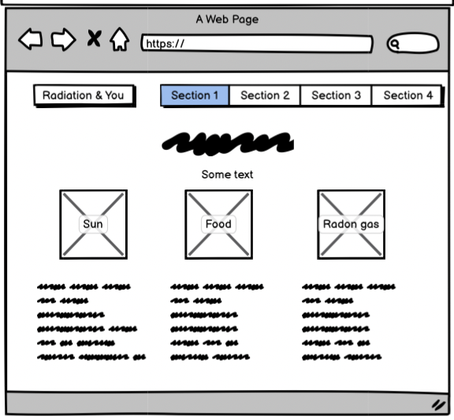

# Radiation & You

The purpose of this website is to give the user a brief and simple overview of the basics of radiation. As a trained healthcare professional in the radiology department, I have the knowledge and understanding of how radiation is used in hospitals; and I would like to share this information through HTML5 and CSS3 to the best of my ability. 

I work full-time in a children’s hospital and hence this website will be catered towards the parents of the children, and possibly the children themselves if they so wished, attending the hospital for a scan. Hence, I aim that this website (layout, content) is designed in a way that a child could understand, but still possess credibility and instills trust in parents that the information they are reading is accurate and dependable. 

## User Experience (UX)

### Structure 

There are 5 pages on the website:
- Home (index.html)
    - Gives user clear understanding of what site is about at a glance. 
    - Provides multiple navigation options for easy access to content throughout the site.
- What Is Radiation? (radiation.html)
    - Gives user simple definitions in an easy to digest format 
    - Gives good nav links 
- How Do We Use Radiation in Medicine? (uses.html)
    - Gives user simple definitions in an easy to digest format 
    - Gives good nav links
- Are There Any Risks Associated with X-rays? (risk.html)
    - Provides key info in a simple and easy to understand way 
    - Gives good nav links
- FAQs (questions.html)
    - Gives user option to contact site owner 
    - Provides good nav links within page

### Design 

#### Colour

Amber-yellow and dark-turquoise were the main colors used for designing the site. Amber-yellow is a colour associated with the radiation symbol and hence I believed was appropriate to be used in this site because of that connotation. Dark-turquoise is the color of the main-image and hence for consistency of design was used across site in different ways to tie together features. These colours are bright and vivid which is visiually appealing for children. Moreover, the fact that two main colors were chosen gives a simplicity and professionalism to the wesbite that would appeal to parents. Other neutral colours were used for other elements to not overwhelm the design. 

#### Font

Roboto and Montserrat were the fonts chosen for the website. I had previously looked up most popular fonts for use in educational website and both these fonts were in the top 10.

<a href="https://www.ilovewp.com/resources/education/wordpress-for-schools/most-used-google-fonts-on-school-websites/">Website link here</a>

#### Images

Images of the wesbite were very important for giving an overall inviting, fun, educational feel to the wesbite which is important for both children and their parents which whom this site is aimed at. I spent many hours scrolling through Pexels, Unsplash and finally Freepik to find the type of descriptive applicable images I wanted. Futher explanation of choice of image for a particular section is detailed below in features. 

#### Content 

Content aimed to give a basic overview of radiation and its uses for children and their parents. Hence, simple definitions and limited text were utilised to avoid overwhelming the users. 

Website content adapted with permission from poster approved by CHI Radiation Safety Committee (October 2019). Original produced by the Radiation Safety Committee, CHI at Crumlin, Version 1d (January 2017). 

## User Stories 
### First time user 
1. As a first time user, I want to easily understand the main purpose of the site.
2. As a first time user, I want to be able to easily navigate through the site to find content.
3. As a first time user, I don't want to be overwhelmed with information. 
4. As a first time user after reading through the site, I want to see what types of questions other people have asked.   
### Returning user
5. As a returning user, I want to access the Contact us page because I've been curious about a question in relation to my/ my child's scan.
6. As a returning user, I want to quicky access the risks associated with radiation page to reread before my child's scan. 
7. As a returning user, I want to go back and check the radon gas levels of the houses of other people I know (I checked my house my first time using the wesbite).  
8. 

### Site owner 
9. As the site owner, I want it be easy for users to navigate through the site without having scroll to top of page again.
10. As the site owner, I want the users to be able to contact us so the site FAQs section can be updated reguarly helpful questions and answers.
11. As the site owner, I want the content to be concise and easy to understand and the design to give a positive emotional response. 

### Wireframes

Home

 

What is Radiation?

 

## Features (and design choices further explained)

There are 15 features on this website: 
### Logo and nav bar

#### Logo
- Logo acts as home button as linked to index.html.
- Logo depicts radiation symbol which is very appropriate for this website and it further confirms this is a website is about radiation in a subtle way.
- Logo:hover styles the radiation symbol with yellow circle background which is a well-known design and colour associated with radiation. This added design allow users to know this is a clickable element.
- User stories covered: 1,2

#### Nav
- Nav appears as dropdown to right of header.
- Nav chosen to be displayed as dropdown to ease responsiveness and consistency of each page header at different screen sizes. 
- While a bootstrap element, font awesome icon chosen by developer instead of pre-defined text. Icon chosen to steer wesbite towards more intuitive layout. This symbol was well-known to the developer through other websites they had visited previously and hence developer believe other users would know this symbol contained the navigation bar. 
- A downside of using this boostrap element was that it could not be styled by the developer. As this was the devloper's first time using bootstrap, they were not 100% comfortable using and and adapting elelments to the page. 
- In future, the developer would like to add add their own dropdown code and style accordingly to completely match website color scheme.
- User stories covered: 2, 5, 7

### Main image and cover text
- User stories covered: 1, 3, 11

#### Main image 
- Cartoon style x-ray of human body as the developed wanted the website assessible to children (as they form part of the target audience). 
- Inclusion of a form of radiation (x-ray) and human body (x-rayed skeleton) was important to the developer for the title 'Radiation & You' to be tied in. Hence, this particular image was chosen as the main image. 
- Original image was somewhat muted and bland so developer increased satruation to match bright colour scheme of rest of site. 

#### Cover Text
- Cover text consists of one h1 and one h2 element.
- h1 element states the title of the site and h2 elemnt gives a brief description of the site to further explain and tie in main image and title. The inclusion of all these elements leaves the user in no doubt to what the site is about. 
- Circle in amber-yellow was chosen in omage to well-know radiation symbol and ties in with logo: hover. 
- The developer played with the idea of including a Begin button within the cover-text but decided a guide would give the user more versility instead. 

### Guide 
- Provides nav on home page for users that may not know of hamburger.
- Orginally designed wesbite without it but during testing realised users might feel a bit lost as the page titles are not listed on first display. 
- User stories covered: 2,4, 5, 6, 7

### Radiation types (3)

- Used flex box to style boxes which aided in consistency and resposiveness of website.
- Created shadow effect behind boxes and feels this adds a nice touch to website.
- Images again were of the cartoonish style as the website was designed with children in mind but in the developer's opinion these still appeared professional enough for parents to engage with. 
- User stories: 3, 11

### Radon map iframe

- Included iframe map as an element of user interaction if they were interested in checking where their house was loacted in relation to radon gas levels.
- Iframe tended to draw focus of the page which interupted the user experience. This was a bug I resolved. 
- User stories covered: 7

### Radiation uses types (5)

- Gives the user a quick overview of the type of scan and where it is commonly used and why.
- Includes an appropriate image related to some aspect of the scan for good visual impact for the user.
- Font color of heading of each different section of was chosen as common color of each of the images on this display on this page. 
- User stories: 3, 11

### Risks table

- Gives the user information of risks in a visual quick and easy way 
- User stories: 

### Contact form 

- Gives the user the opportunity to contact us with any questions they may have
- User stories: 5, 10

### Aside and FAQ section

- Gives a quick overview of questions that have already been asked to give the user an idea of questions that may want to ask 
- Includes links to those questions further down the page 
- Underlined as per consistency with other clickable links on the page 
- User stories covered: 4

## Testing 
### Automated 
- Jigsaw (CSS Code Validator)

-  HTML validator 

    - Home 
    

    - What is radiation?

### Performance

### Non-Automated

## Deployment

## Credits 
